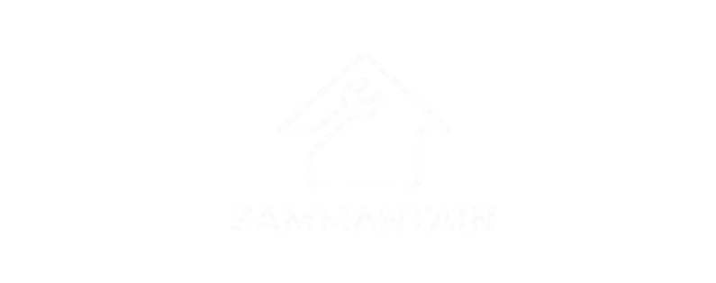

<p align="center">
  
</p>

<h1 align="center">🏡 ZamMaintain — Cloud Property Maintenance Platform</h1>

<p align="center"><strong>Report issues. Coordinate repairs. Manage properties.</strong></p>

<p align="center">An ASP.NET Core MVC and AWS application connecting tenants, property teams, and technicians through a shared maintenance workflow.</p>

<p align="center">
  
  
  
  
  
</p>

<p align="center"><a href="#overview">Overview</a> · <a href="#features">Features</a> · <a href="#architecture">Architecture</a></p>

<a id="overview"></a>

## 🌍 Overview

ZamMaintain is a property maintenance platform developed as an **academic assignment project** for **Designing and Developing Applications on the Cloud**. It helps property management companies organise buildings and units, receive maintenance requests, assign technicians, track repairs, and manage related payments.

The project provides browser-based portals for tenants, technicians, managers, company administrators, and platform administrators. These interfaces share an ASP.NET Core backend, a PostgreSQL database on Amazon RDS, and Amazon S3 file storage. A separate AWS Lambda and API Gateway workflow demonstrates storage monitoring for the assignment.

### Why ZamMaintain?

Property maintenance involves more than reporting a broken fixture. Tenants need updates, managers need to coordinate technicians, and administrators need records of work, costs, and company activity.

ZamMaintain addresses these needs through:

- **Centralised property management:** companies, properties, units, and user accounts in one system.
- **Structured maintenance:** request submission, assignment, progress updates, completion proof, and feedback.
- **Connected communication:** real-time chat, inbox updates, and in-app notifications.
- **Payment visibility:** service payments, technician earnings and payouts, and company subscription records.
- **Administrative oversight:** dashboards, reports, technician approval, and audit logs.
- **Cloud integration:** database hosting, object storage, application deployment configuration, and serverless monitoring.

<a id="features"></a>

## ✨ Key Features

### 🏠 For Tenants

| Area | Features |
| --- | --- |
| Account and profile | Sign in, manage profile information, update an avatar, and access password recovery. |
| Property information | View assigned unit and property details. |
| Maintenance requests | Submit issues with supporting photos and inspect request details. |
| Progress tracking | Follow request status and repair progress. |
| Messaging | Communicate through conversations with real-time chat updates. |
| Notifications | View maintenance-related notifications. |
| Feedback | Submit feedback on maintenance work. |

### 🛠️ For Technicians

| Area | Features |
| --- | --- |
| Registration and approval | Register a technician profile and submit supporting documents for review. |
| Assigned work | View assigned requests and manage work progress. |
| Completion evidence | Upload proof of completed repairs. |
| Communication | Use messaging and receive work-related notifications. |
| Earnings and payments | Inspect payment records, earnings, and payout information. |
| Profile | Manage technician details and account information. |

### 🖥️ For Managers and Administrators

- **Manager dashboard:** review maintenance activity, pending work, and completed repairs.
- **Request coordination:** inspect requests, assign technicians, and monitor technician workloads.
- **Company administration:** manage properties, units, users, and company settings.
- **Reports:** review maintenance and payment information through reporting screens.
- **Communication:** access messages and notifications associated with operational work.
- **Company billing:** manage subscription workflows and billing history.
- **Platform oversight:** manage companies, review technician registrations, and inspect platform activity.
- **Financial oversight:** review technician payouts, commission reporting, and payment records.
- **Audit history:** inspect recorded administrative actions.

Administrative access is separated into **Manager**, **Administrator**, and **SuperAdmin** roles. Tenants and technicians have their own portals. Platform administrators use `/SuperAdmin/Login`; other users sign in through `/Identity/Account/Login`.

## 🔄 How It Works

1. **Set up the company:** register and organise company users, properties, and units.
2. **Report an issue:** a tenant submits a maintenance request with a description and supporting photos.
3. **Coordinate the repair:** the property team reviews the request and assigns a technician.
4. **Track the work:** the technician updates progress while participants communicate and receive notifications.
5. **Record completion:** upload completion evidence, review the repair, and collect tenant feedback.
6. **Review operations:** inspect applicable payment records, reports, subscriptions, and audit history.

## 🛡️ Trust and Verification

Access and accountability are implemented across the application and its cloud integrations:

- **Identity and roles:** ASP.NET Core Identity manages accounts and cookie-based sign-in; role restrictions separate the five user groups.
- **Technician review:** registration includes supporting documents and an administrator approval workflow.
- **Conversation access:** the SignalR hub checks membership before joining a conversation or updating its read state.
- **Request accountability:** status history, completion photos, feedback, and audit records support review of maintenance activity.
- **Form protection:** controller actions use anti-forgery validation for protected form submissions.
- **Transport and cookies:** HTTPS redirection, production HSTS, and secure production authentication cookies are configured.
- **File storage:** S3 stores uploaded files; the application includes an authenticated storage route for retrieving objects.
- **Payment callbacks:** the Xendit integration checks the configured callback token when validating webhook requests.

Database credentials, payment keys, and SMTP credentials should be supplied through private configuration. The GitHub copy uses a placeholder database password.

## 🧰 Technology Stack

| Layer | Technologies |
| --- | --- |
| Web application | ASP.NET Core MVC and Razor Pages on .NET 8 |
| Application language | C# |
| User interface | Razor views, HTML, CSS, JavaScript, and Bootstrap |
| Client-side validation | jQuery Validation and jQuery Unobtrusive Validation |
| Application organisation | MVC Areas, view models, dependency injection, and application services |
| Authentication | ASP.NET Core Identity, roles, and authentication cookies |
| Data access | Entity Framework Core 8 and the Npgsql PostgreSQL provider |
| Database | PostgreSQL hosted on Amazon RDS |
| File storage | Amazon S3 and the AWS SDK for .NET |
| Real-time messaging | ASP.NET Core SignalR and the JavaScript SignalR client |
| Payments | Xendit integration, with application services for subscriptions and technician payments/payouts |
| Email | SMTP through MailKit and MimeKit |
| Serverless monitoring | AWS Lambda, Python 3.12, and Boto3 |
| Monitoring endpoint | Amazon API Gateway |
| Cloud observability | Amazon CloudWatch logs and the assignment monitoring dashboard |
| Cloud permissions | AWS Identity and Access Management (IAM) roles and policies |
| Deployment configuration | AWS Elastic Beanstalk, Amazon EC2, Amazon Linux, and Nginx |
| Development and delivery | .NET SDK, NuGet, Visual Studio deployment settings, AWS CLI, Git, and GitHub |

### ☁️ AWS Services and Their Roles

| Service | Use in the project |
| --- | --- |
| AWS Elastic Beanstalk | Saved deployment settings for the ASP.NET Core application environment. |
| Amazon EC2 | Compute instance configuration underlying the Beanstalk environment. |
| Amazon RDS | PostgreSQL storage for accounts, companies, properties, maintenance, messages, and payment records. |
| Amazon S3 | Storage for avatars, issue photos, completion proof, property images, and technician documents. |
| AWS Lambda | Runs the S3 status function that lists object metadata and returns a JSON summary. |
| Amazon API Gateway | Exposes the assignment's GET /s3-status monitoring endpoint. |
| Amazon CloudWatch | Captures Lambda execution logs and supports the assignment monitoring dashboard. |
| AWS IAM | Provides service roles and permissions for application hosting and Lambda access to S3 and logs. |

The saved AWS configuration and monitoring evidence use **Asia Pacific (Singapore), ap-southeast-1**. These files describe the assignment setup; they do not establish current cloud resource availability. Email delivery and Xendit API operations require their respective private settings.

<a id="architecture"></a>

## 🏗️ Architecture

ZamMaintain separates its role-specific interfaces into MVC Areas while sharing domain models, database access, and application services. Controllers handle requests, services coordinate workflows and integrations, and Razor views render the browser interface. Entity Framework Core connects to PostgreSQL, the storage service handles S3 files, and SignalR provides real-time conversation updates.

```text
Browser: tenant / technician / manager / administrator / super admin
                              |
                    ASP.NET Core MVC application
                    Controllers, views, and services
                       |          |          |
                 RDS PostgreSQL   S3     Xendit / SMTP

Monitoring: API Gateway → Python Lambda → S3 object metadata
                                  |
                           CloudWatch logs
```

```text
Areas/
├── Administrator/        Company administration portal
├── Identity/             Login, registration, and account pages
├── Manager/              Maintenance coordination portal
├── SuperAdmin/           Platform administration portal
├── Technician/           Technician work and payment portal
└── Tenant/               Tenant requests, feedback, and messages

Controllers/              Shared entry points, storage, and payments
Data/                     Entity Framework database context
Hubs/                     SignalR chat hub
Models/                   Domain entities and Identity models
Services/                 Business workflows and external integrations
ViewModels/               Data prepared for application views
Views/                    Shared layouts and public pages
wwwroot/                  Styles, scripts, libraries, and branding
.platform/                Nginx deployment configuration
lambda/                   Python S3 status monitoring function
docs/task2-evidence/      Saved Lambda/API responses and monitoring notes
docs/study-guide/         Application walkthrough documentation
Program.cs                Service registration, middleware, and routing
appsettings.json          Application configuration
CloudMVCApplication.csproj .NET target and NuGet dependencies
```

The monitoring Lambda is a separate assignment component. The main web application accesses RDS and S3 through its own backend services.

## 🧪 Testing

The repository includes saved assignment evidence for the Lambda S3 status invocation, the API Gateway response, and CloudWatch execution logs in [docs/task2-evidence/](docs/task2-evidence/). These records document the captured monitoring demonstration.

A dedicated automated test project is not included in this source snapshot. Functional review should cover role-based access, maintenance submission and assignment, completion proof, messaging, feedback, and configured payment and email flows.

The current snapshot references `DbSeeder` in startup but does not include its implementation or an EF Core migrations directory. Those database setup files need to be restored or the startup setup revised before this snapshot can support a complete fresh build and database setup.

## 🎓 Project Status and Credits

ZamMaintain is an **academic assignment project** for **Designing and Developing Applications on the Cloud**, developed at **Asia Pacific University (APU)**. This repository presents the web application, cloud integration code, and supporting assignment evidence for authorised academic review.

**Developer:** Faisal Mohammed Ezzaddin Saif Ahmed.

## 🔒 Access and Usage

Access is limited to authorised reviewers. The source code is provided for academic review only. Running the application, using its connected APIs or billed cloud services, copying, modifying, or redistributing the project requires the author's explicit permission.

